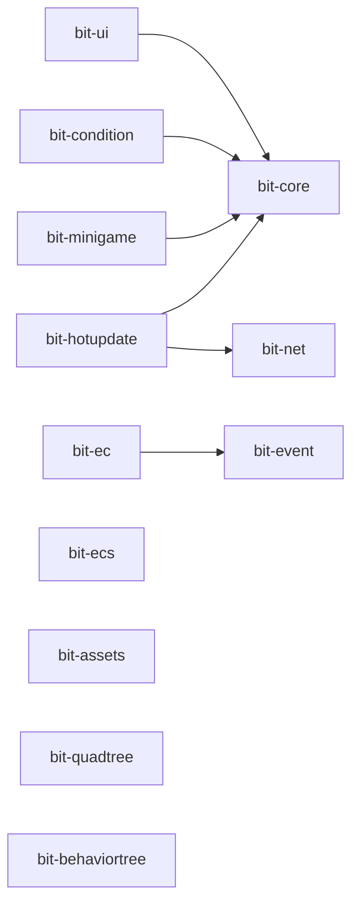

# Bit Framework 架构设计

## 架构总览

基于 **pnpm Monorepo** 的游戏框架集合，专为 Cocos Creator 3.x 设计。12 个独立模块，统一仓库管理，独立发布。

```
bit-framework/
├── bit-core/         # 核心工具（Time, Platform, Timer, Utils）
├── bit-ui/           # FairyGUI UI 管理（窗口、装饰器）
├── bit-ecs/          # 高性能 ECS 架构
├── bit-ec/           # Cocos 适配 EC 架构
├── bit-event/        # 全局事件系统
├── bit-net/          # HTTP + WebSocket
├── bit-assets/       # 资源加载管理
├── bit-quadtree/     # 四叉树碰撞检测
├── bit-behaviortree/ # AI 行为树
├── bit-condition/    # UI 条件显示（红点）
├── bit-minigame/     # 小游戏平台适配
├── bit-hotupdate/    # 热更新系统
└── bit-demo/         # Cocos Creator 示例项目
```

## 模块依赖关系



| 模块 | 依赖 |
|------|------|
| bit-core | 无 |
| bit-event / bit-ecs / bit-net / bit-assets / bit-quadtree / bit-behaviortree | 无 |
| bit-ui / bit-condition | bit-core + fairygui-cc |
| bit-minigame | bit-core |
| bit-ec | bit-event |
| bit-hotupdate | bit-core + bit-net |

## 技术栈

| 技术 | 版本 | 用途 |
|------|------|------|
| TypeScript | 5.x | 开发语言 |
| pnpm | 8.x+ | 包管理器 + workspace |
| Rollup | 4.x | 构建打包 |
| Cocos Creator | 3.7.0+ | 游戏引擎 |
| FairyGUI | 1.2.2 | UI 编辑器（bit-ui 使用） |

## 构建输出

每个模块 `dist/` 目录生成：

```
bit-xxx.mjs / .cjs          # ESM / CommonJS（未压缩）
bit-xxx.min.mjs / .min.cjs  # ESM / CommonJS（压缩，生产用）
bit-xxx.d.ts                # TypeScript 类型定义
```

统一构建配置：`rollup.config.base.mjs`，所有模块共用。

## TypeScript 约定

```json
{
  "experimentalDecorators": true,  // 装饰器广泛使用
  "strictNullChecks": false,        // Cocos Creator 兼容性
  "declaration": true               // 生成 .d.ts
}
```

## 装饰器模式

| 模块 | 装饰器 | 用途 |
|------|--------|------|
| bit-ui | `@uiclass` `@uiprop` `@uiclick` | UI 窗口注册 |
| bit-ecs | `@ecsclass` `@ecsprop` `@ecsystem` | ECS 组件/系统 |
| bit-ec | `@ecclass` `@ecprop` | EC 组件 |
| bit-condition | `@condition` | 条件类注册 |
| bit-behaviortree | `@ClassAction` `@prop` | 行为树节点 |

## 设计原则

1. **单向依赖** — 禁止循环依赖，双向通信通过 bit-event
2. **依赖最小** — 运行时零额外依赖（除引擎）
3. **类型安全** — 禁止 `as any`，完整类型导出
4. **性能优先** — 使用对象池减少 GC，密集数据结构
5. **可扩展** — 抽象类 + 接口 + 生命周期钩子

## 新增模块规范

```
bit-xxx/
├── src/index.ts       # 导出所有公开 API
├── dist/              # 构建产物（git 忽略）
├── package.json       # name: @gongxh/bit-xxx
├── tsconfig.json      # 继承根配置
├── rollup.config.mjs  # 引用 rollup.config.base.mjs
└── README.md
```

添加到 `pnpm-workspace.yaml` 和根 `package.json` 的 `build:xxx` / `publish:xxx` 脚本。
